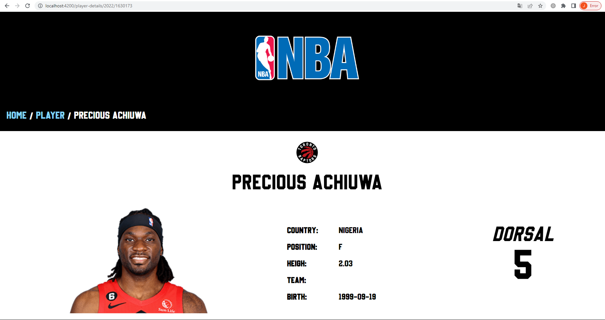

# NBApi

### Trabajo realizado por José Luis Gil Martín y José Luis Hidalgo Navas

## Descripción

Este proyecto consiste en crear una página web de la NBA a partir de una API de un
repositorio en github https://github.com/kshvmdn/nba.js/blob/master/docs/api/DATA.md
de la cual podemos sacar distintos datos. Nosotros hemos utilizado teams, players, standings 
y coaches. A continuación vamos a explicar lo que puedes hacer dentro de este proyecto.

## Initial-page

Menú para navegar por las distintas funcionalidades de la página

## Teams (José Luis Gil Martín)

Dentro de Teams podrás ver el listado de equipos de la NBA por año. En cada carta exiten dos botones:

**Details**: donde entrarás a ver los detalles de cada equipo.

**Roster**: donde verás los jugadores del equipo por año.

## Players (José Luis Hidalgo Navas)

Dentro de Players podrás ver el listado de jugadores de cada año que han participado en la NBA.
En cada carta existe un botón:

**Details**: donde verás los detalles de cada jugador por año.

## Standings (José Luis Gil Martín)

Dentro de Standings podrás ver la clasificación de un día en concreto separados por conferecia
(East and West). Puedes clicar en cada nombre de equipo para ir a ver el roster que formaban en ese
año.

## Coaches

Dentro de coaches podrás ver el listado de entrenadores que había por cada año en la NBA.

